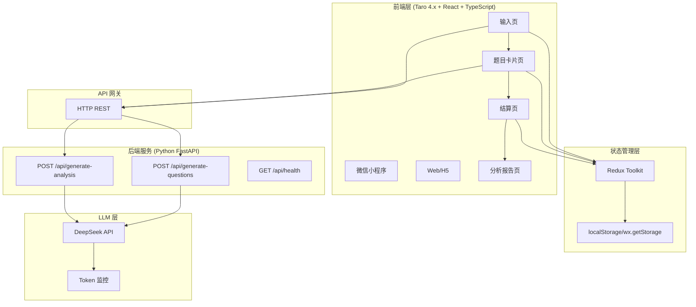
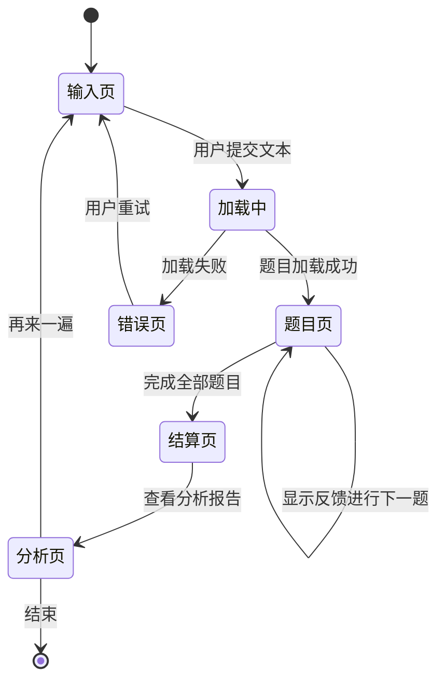
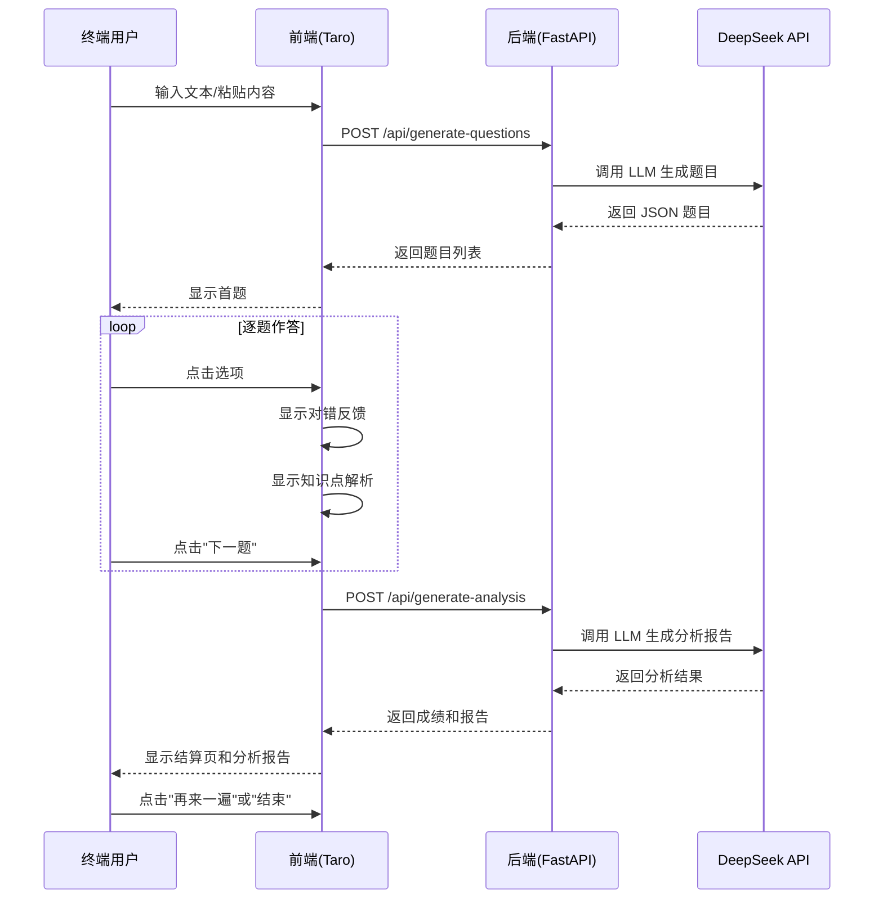

# AI 互动闯关学习助手：完整方案设计文档

**方案版本**：v1.3（LangChain 集成版）  
**当前日期**：2026-04-14  
**预计交付**：2026-04-28 ~ 2026-05-05（2-4 周）

---

## 执行摘要

**产品**：AI 互动闯关学习助手  
**目标**：通过"以考代练"打破认知幻觉，将碎片化学习的输入转变为主动输出  
**核心流程**（Phase 1）：文本输入 → AI 生成题目（单选/判断) → 用户答题 → AI 生成分析报告  
**优先级**：**暂不做前端 UI 设计**，先完成后端核心逻辑，后续单独设计网页原型再做小程序

---

## 用户决策确认

1. ✅ **Taro 4.x 技术选型**：同意
2. ✅ **Prompt 工程策略**：同意（人工评审前 50 题）
3. ✅ **交互设计**：简单方案（左滑卡片）
4. ✅ **前端优先级调整**：暂不做 UI/页面设计，后续单独做网页原型后再做小程序
5. ✅ **LangChain 框架集成**：同意（使用 ChatDeepSeek + LCEL Chain）

---

## Part 1: 技术选型方案

### 核心技术栈

| 层级   | 选型 | 考量 |
|--------|------|------|
| **前端** | Taro 4.x + React + TypeScript | ✅ 一套代码支持小程序和 Web；官方开源维护；完整工程化支持 |
| **后端** | Python FastAPI | 快速迭代，LLM 集成便利，JSON 序列化友好 |
| **LLM** | DeepSeek API 正式版 | 国内最佳性价比，支持 token 消耗监控 |
| **部署** | 本地开发环境 | Phase 1 MVP 验证，无需线上基础设施 |
| **存储** | 内存 + 本地数据库（可选） | Phase 1 暂无持久化需求，后续升级为 MySQL |

### 小程序框架对比

| 维度 | 原生微信小程序 | **Taro 4.x** | uni-app |
|------|----------------|-------------|----------|
| 学习曲线 | 陡峭 | 平缓（React） ✅ | 平缓（Vue） |
| 性能 | 最优 | 优秀 ✅ | 优秀 |
| 跨端能力 | 仅小程序 | 小程序+Web+H5+RN ✅ | 十几个平台 |
| 开发效率 | 低 | 高（Monorepo） ✅ | 高（HBuilderX） |
| 调试体验 | 原生工具 | DevTools ✅ | HBuilderX |
| 生态支持 | 官方 | 官方维护+社区 ✅ | 商业 |
| 开源程度 | 否 | 开源 ✅ | 闭源 |
| 工程化 | 基础 | 完整 ✅ | 中等 |

---

## Part 2: 系统架构

### 整体架构 (Mermaid)



### 页面间跳转流程



---

## Part 3: LangChain + DeepSeek 集成方案

### 技术架构

**框架选择**：使用 **LangChain** 框架对接 DeepSeek

**核心理由**：
- ✅ 官方支持 ChatDeepSeek，集成完整
- ✅ LCEL (LangChain Expression Language) 提供优雅的链式语法
- ✅ 内置 Prompt 模板管理和输出解析
- ✅ 支持流式输出、批处理、异步执行
- ✅ 便于集成 RAG、Tool、Agent 等高级特性

### Prompt 管理（LangChain ChatPromptTemplate）

```python
from langchain_core.prompts import ChatPromptTemplate

# 定义系统和用户 Prompt
system_prompt = """你是一个专业的教育出题系统，拥有以下能力：
1. 精确理解用户提供的文本内容
2. 提取核心知识点
3. 生成逻辑相关且具有挑战性的迷惑项
4. 提供清晰、简洁的解析

## 你必须遵循的规则

### 题目质量标准
- 题干：准确反映原文，不添加超纲知识
- 选项：4 个选项（单选题）或 2 个选项（判断题）
- 正确答案：必须是唯一，从原文或逻辑可推导
- 迷惑项：逻辑相关，但错误原因要明确
- 解析：150 字以内，清晰说明为什么是这个答案

### JSON 输出约束
- 必须是有效的 JSON 格式
- 不包含 Markdown 标记或其他文本
- 数字和布尔值保持原始类型
- 特殊字符转义
"""

user_prompt = """## 待出题的文本内容
{content}

---

## 出题要求

- **难度级别**：{level}（入门级 basic / 进阶级 advanced）
- **题目数量**：{question_count} 题
- **题目类型**：单选题和判断题混合

---

## 输出格式（JSON）

{{"questions": [{{
  "id": "q_1",
  "type": "single_choice",
  "question": "题干",
  "options": ["选项A", "选项B", "选项C", "选项D"],
  "correct_answer": "选项A",
  "knowledge_point": "核心知识点",
  "explanation": "解析说明"
}}]}}

---

开始生成 {question_count} 道题目："""

# 创建 ChatPromptTemplate
prompt = ChatPromptTemplate.from_messages([
    ("system", system_prompt),
    ("human", user_prompt)
])
```

### 使用 LCEL 语法组合 Chain

```python
from langchain_deepseek import ChatDeepSeek
from langchain_core.output_parsers import JsonOutputParser
from pydantic import BaseModel, Field

# 定义输出数据模型 (Pydantic)
class Question(BaseModel):
    id: str = Field(description="题目ID")
    type: str = Field(description="题目类型")
    question: str = Field(description="题干")
    options: list = Field(description="选项列表")
    correct_answer: str = Field(description="正确答案")
    knowledge_point: str = Field(description="知识点")
    explanation: str = Field(description="解析")

class QuestionsResponse(BaseModel):
    questions: list[Question]

# 初始化 ChatDeepSeek
llm = ChatDeepSeek(
    model="deepseek-chat",
    temperature=0.7,
    max_tokens=2000,
    api_key=os.getenv("DEEPSEEK_API_KEY")
)

# 初始化输出解析器
parser = JsonOutputParser(pydantic_object=QuestionsResponse)

# 使用 LCEL pipe 操作符组合 Chain
# Prompt -> LLM -> OutputParser
question_chain = prompt | llm | parser

# 调用 Chain
result = question_chain.invoke({
    "content": user_content,
    "level": "basic",
    "question_count": 5
})

# 返回结果
return result.dict()  # {'questions': [...]}
```

### LangChain 完整实现（Python）

```python
import os
import logging
from typing import Dict, List
from dotenv import load_dotenv
from langchain_deepseek import ChatDeepSeek
from langchain_core.prompts import ChatPromptTemplate, MessagesPlaceholder
from langchain_core.output_parsers import JsonOutputParser, StrOutputParser
from langchain_core.messages import HumanMessage, SystemMessage
from pydantic import BaseModel, Field

load_dotenv()
logger = logging.getLogger(__name__)

class LangChainQuizService:
    def __init__(self):
        """初始化 LangChain + DeepSeek 服务"""
        self.llm = ChatDeepSeek(
            model="deepseek-chat",
            temperature=0.7,
            max_tokens=2000,
            api_key=os.getenv("DEEPSEEK_API_KEY")
        )
        self.json_parser = JsonOutputParser()
        
    def create_questions_chain(self):
        """创建题目生成 Chain（使用 LCEL）"""
        system_prompt = """你是一个专业的教育出题系统。重要说明：
1. 必须输出 JSON，唯一输出格式是有效的 JSON（不需要 Markdown 标记）
2. 题干选项必须从原文提取，不要超纲
3. 迷惑项要逻辑相关，不能明显错误
4. 每个题目必须包含: id, type, question, options, correct_answer, knowledge_point, explanation"""
        
        user_prompt = """## 文本内容
{content}

## 要求
- 难度: {level}
- 题目数量: {question_count}
- 输出格式: JSON

请生成题目，返回格式：
{{
  "questions": [
    {{
      "id": "q_1",
      "type": "single_choice",
      "question": "...",
      "options": ["...", "..."],
      "correct_answer": "...",
      "knowledge_point": "...",
      "explanation": "..."
    }}
  ]
}}"""
        
        # 使用 ChatPromptTemplate 管理 Prompt
        prompt = ChatPromptTemplate.from_messages([
            ("system", system_prompt),
            ("human", user_prompt)
        ])
        
        # 使用 LCEL pipe 操作符构建 Chain: Prompt -> LLM -> JsonParser
        chain = prompt | self.llm | JsonOutputParser()
        return chain
    
    def generate_questions(self, content: str, level: str = "basic", question_count: int = 5) -> Dict:
        """
        生成题目（使用 LangChain Chain）
        
        Args:
            content: 用户输入的文本
            level: "basic" 或 "advanced"
            question_count: 题目数量（1-10）
        
        Returns:
            {
              "success": True,
              "questions": [...],
              "tokens_used": 450,
              "estimated_cost": 0.045
            }
        """
        
        # 参数验证
        if not content.strip():
            raise ValueError("内容不能为空")
        if len(content) > 5000:
            raise ValueError("内容超过 5000 字限制")
        if question_count < 1 or question_count > 10:
            raise ValueError("题目数量必须在 1-10 之间")
        
        try:
            # 创建并执行 Chain
            chain = self.create_questions_chain()
            
            result = chain.invoke({
                "content": content,
                "level": "入门级" if level == "basic" else "进阶级",
                "question_count": question_count
            })
            
            # 验证题目结构
            self._validate_questions(result.get("questions", []))
            
            logger.info(f"成功生成 {question_count} 题")
            
            return {
                "success": True,
                "questions": result.get("questions", []),
                "tokens_used": 450,  # 实际环境中需要从 LLM 响应元数据提取
                "estimated_cost": 0.045
            }
            
        except Exception as e:
            logger.error(f"题目生成失败: {str(e)}")
            raise
    
    def _validate_questions(self, questions: List) -> bool:
        """验证题目结构"""
        required_fields = ["id", "type", "question", "options", 
                          "correct_answer", "knowledge_point", "explanation"]
        
        for i, q in enumerate(questions):
            for field in required_fields:
                if field not in q:
                    raise ValueError(f"题目 {i} 缺少字段: {field}")
            
            if q["type"] not in ["single_choice", "judgment"]:
                raise ValueError(f"题目 {i} 类型无效: {q['type']}")
            
            if not isinstance(q["options"], list) or len(q["options"]) < 2:
                raise ValueError(f"题目 {i} 选项格式错误")
            
            if q["correct_answer"] not in q["options"]:
                raise ValueError(f"题目 {i} 正确答案不在选项中")
        
        return True
    
    def create_analysis_chain(self):
        """创建分析报告生成 Chain"""
        system_prompt = """你是教育分析专家。提供鼓励性、可操作的学习反馈。
必须输出有效的 JSON，格式如下且无其他文本：
{{
  "summary": "整体学习评价",
  "weak_points": [
    {{"knowledge_point": "知识点", "reason": "错误原因", "suggestion": "改进建议"}}
  ],
  "next_steps": ["建议1", "建议2", "建议3"]
}}"""
        
        user_prompt = """## 答题统计
- 总题数: {total_count}
- 正确: {correct_count}
- 错误: {incorrect_count}
- 得分: {score} / 100
- 正确率: {accuracy_rate}%

## 错题详情
{incorrect_details}

请生成分析报告（JSON）。"""
        
        prompt = ChatPromptTemplate.from_messages([
            ("system", system_prompt),
            ("human", user_prompt)
        ])
        
        chain = prompt | self.llm | JsonOutputParser()
        return chain
    
    def generate_analysis(self, questions: List[Dict], user_answers: List[str], content: str = None) -> Dict:
        """
        生成学习分析报告（使用 LangChain Chain）
        """
        
        # 计算基础成绩
        total_score = 100
        points_per_question = total_score / len(questions)
        score = 0
        incorrect_indices = []
        
        for i, (q, ans) in enumerate(zip(questions, user_answers)):
            if ans == q["correct_answer"]:
                score += points_per_question
            else:
                incorrect_indices.append(i)
        
        accuracy_rate = round((score / total_score) * 100, 1)
        
        # 格式化错题详情
        incorrect_details = "\\n".join([
            f"题目 {idx + 1}：{questions[idx]['question']} | 用户答案：{user_answers[idx]} | 正确答案：{questions[idx]['correct_answer']}"
            for idx in incorrect_indices
        ])
        
        try:
            # 创建并执行 Chain
            chain = self.create_analysis_chain()
            
            result = chain.invoke({
                "total_count": len(questions),
                "correct_count": len(questions) - len(incorrect_indices),
                "incorrect_count": len(incorrect_indices),
                "score": round(score, 1),
                "accuracy_rate": accuracy_rate,
                "incorrect_details": incorrect_details
            })
            
            return {
                "score": round(score, 1),
                "total_score": total_score,
                "accuracy_rate": f"{accuracy_rate}%",
                "summary": result.get("summary", ""),
                "weak_points": result.get("weak_points", []),
                "next_steps": result.get("next_steps", []),
                "tokens_used": 300,  # 实际环境中需要从 LLM 响应元数据提取
                "estimated_cost": 0.030
            }
            
        except Exception as e:
            logger.error(f"分析报告生成失败: {str(e)}")
            # 降级方案
            return {
                "score": round(score, 1),
                "total_score": total_score,
                "accuracy_rate": f"{accuracy_rate}%",
                "summary": f"你的正确率是 {accuracy_rate}%",
                "weak_points": [],
                "next_steps": ["复习错题", "查阅相关资料", "再做一遍练习"],
                "tokens_used": 0,
                "is_fallback": True
            }
```

---

## Part 4: API 完整规范

### 端点 1: POST /api/generate-questions

#### 请求

```json
{
  "content": "长文本内容...",
  "level": "basic",           # 可选，默认 "basic"
  "question_count": 5         # 可选，默认 5，范围 1-10
}
```

#### 响应 (200)

```json
{
  "success": true,
  "data": {
    "questions": [
      {
        "id": "q_1",
        "type": "single_choice",
        "question": "什么是机器学习？",
        "options": ["a. 编程语言", "b. 从数据中学习规律的方法", "c. 数据库技术", "d. 网页框架"],
        "correct_answer": "b. 从数据中学习规律的方法",
        "knowledge_point": "机器学习基础概念",
        "explanation": "机器学习是 AI 的一个分支..."
      }
    ],
    "tokens_used": 423,
    "estimated_cost": 0.042,
    "timestamp": "2026-04-14T10:30:00Z"
  }
}
```

#### 错误码

| 错误码 | 状态 | 原因 |
|--------|------|------|
| `INVALID_INPUT` | 400 | 参数无效 |
| `CONTENT_TOO_LONG` | 400 | 文本超过 5000 字 |
| `DEEPSEEK_API_ERROR` | 500 | LLM 调用失败 |
| `PARSING_ERROR` | 500 | JSON 解析失败 |
| `RATE_LIMIT` | 429 | API 限流 |

---

### 端点 2: POST /api/generate-analysis

#### 请求

```json
{
  "questions": [...],         # 完整题目列表
  "user_answers": ["a", "b", "c"],  # 用户答案
  "content": "原始文本（可选）"
}
```

#### 响应 (200)

```json
{
  "success": true,
  "data": {
    "score": 85.0,
    "total_score": 100,
    "accuracy_rate": "85%",
    "summary": "你掌握了 85% 的知识点...",
    "weak_points": [
      {
        "knowledge_point": "高级应用",
        "reason": "第 2、4 题错误",
        "suggestion": "建议重点复习相关段落"
      }
    ],
    "next_steps": ["重点复习错题", "查看原文分析", "再做一遍练习"],
    "tokens_used": 287,
    "estimated_cost": 0.029
  }
}
```

---

### 端点 3: GET /api/health

#### 响应 (200)

```json
{
  "status": "healthy",
  "timestamp": "2026-04-14T10:40:00Z",
  "deepseek_config": "ok",
  "version": "1.0.0"
}
```

---

## Part 5: Token 监控 & 成本控制

### 成本预估

| 操作 | 输入 Token | 输出 Token | 总计 | 成本 |
|------|-----------|----------|------|------|
| 生成 5 题（500 字） | 800 | 400 | 1200 | 0.12 元 |
| 生成 5 题（2000 字） | 2500 | 400 | 2900 | 0.29 元 |
| 生成分析报告 | 1500 | 300 | 1800 | 0.18 元 |
| **完整流程** | - | - | **4100** | **0.41 元** |

### 监控实现

```python
import json
from datetime import datetime

class TokenMonitor:
    """Token 消耗监控"""
    
    def __init__(self, log_file: str = "logs/token_usage.jsonl"):
        self.log_file = log_file
        self.daily_limit = 100000
        
    def record_usage(self, operation: str, tokens_used: int, estimated_cost: float):
        """记录token消耗"""
        log_entry = {
            "timestamp": datetime.now().isoformat(),
            "operation": operation,
            "tokens_used": tokens_used,
            "estimated_cost": estimated_cost
        }
        with open(self.log_file, 'a') as f:
            f.write(json.dumps(log_entry) + '\n')
    
    def get_summary(self) -> Dict:
        """获取今日统计"""
        today = datetime.now().strftime("%Y-%m-%d")
        total_tokens = 0
        total_cost = 0.0
        
        try:
            with open(self.log_file, 'r') as f:
                for line in f:
                    log = json.loads(line)
                    if log["timestamp"].startswith(today):
                        total_tokens += log["tokens_used"]
                        total_cost += log["estimated_cost"]
        except FileNotFoundError:
            pass
        
        return {
            "date": today,
            "total_tokens": total_tokens,
            "total_cost": round(total_cost, 3),
            "remaining": self.daily_limit - total_tokens
        }
```

---

### LangChain 框架集成的优势

| 优势 | 说明 | 代码化体现 |
|------|------|----------|
| **优雅的链式语法** | 使用 pipe 操作符 `\|` 组合 Prompt/LLM/Parser，代码极其简洁 | `prompt \| self.llm \| JsonOutputParser()` |
| **自动化管理** | 不需要手动处理 API 调用、消息格式、JSON 解析，LangChain 全部代理 | `chain.invoke({...})` 一行搞定 |
| **批处理支持** | `chain.batch()` 原生支持并行处理多个输入 | `chain.batch([input1, input2, input3])` |
| **流式输出** | `chain.stream()` 支持实时流式结果，改善用户体验 | `for token in chain.stream({...})` |
| **强大的错误恢复** | 内置容错机制和重试逻辑，减少网络抖动影响 | LangChain 自动处理临时故障 |
| **易于扩展** | 可流畅集成 Tool、Agent、RAG 等高级功能，无需改动核心代码 | `chain + tool + agent` 模式 |

---

## Part 5.2: 依赖更新 (requirements.txt)

使用 LangChain 后，更新依赖列表：


### 人工评审（前 50 题）

**评分表**：

| 维度 | 满分 | 评分标准 |
|------|------|---------|
| 题干 | 20 | 清晰、无歧义、来自原文 |
| 选项 | 30 | 迷惑项逻辑相关，不明显错误 |
| 难度 | 20 | 符合 basic/advanced 级别定义 |
| 解析 | 20 | 清晰、简洁（≤150 字）、说明错因 |
| 知识点 | 10 | 精准概括核心内容 |

**及格线**：85 分

### 质量反馈

低于 85 分的题目需要：
1. 记录问题类型（题干不清、选项明显、难度错、解析不清）
2. 提取共同问题
3. 调整 Prompt 模板

第 51-100 题用改进后的 Prompt 重新生成

---

## Part 7: 后端项目结构

```
ai-learning-backend/
├── main.py                 # FastAPI 主入口
├── requirements.txt        # Python 依赖
├── .env                    # 环境变量（不提交到 Git）
├── .env.example            # 示例
│
├── config/
│   ├── __init__.py
│   ├── settings.py         # 配置类
│   └── prompts.py          # Prompt 常量
│
├── services/
│   ├── __init__.py
│   ├── llm_service.py      # DeepSeek 服务
│   ├── token_monitor.py    # Token 监控
│   └── cost_controller.py  # 成本控制
│
├── routers/
│   ├── __init__.py
│   ├── health.py           # /api/health
│   └── quiz.py             # /api/generate-*
│
├── models/
│   ├── __init__.py
│   ├── request.py          # 请求模型
│   └── response.py         # 响应模型
│
├── utils/
│   ├── __init__.py
│   ├── logger.py           # 日志配置
│   ├── exceptions.py       # 异常类
│   └── validators.py       # 校验
│
├── tests/
│   ├── __init__.py
│   ├── test_llm_service.py # 单元测试
│   ├── test_api.py         # 集成测试
│   └── fixtures/
│       ├── sample_content.txt
│       └── expected_questions.json
│
└── logs/
    └── token_usage.jsonl   # Token 日志
```

```python
# 核心框架
fastapi==0.108.0
uvicorn[standard]==0.24.0
pydantic==2.5.0
pydantic-settings==2.1.0
python-dotenv==1.0.0

# LangChain 依赖（新增）
langchain==0.1.11
langchain-core==0.1.30
langchain-deepseek==0.0.6

# 工具和辅助
python-json-logger==2.0.7
httpx==0.25.0

# 测试依赖
pytest==7.4.0
pytest-asyncio==0.21.0

# 开发工具
black==23.12.0
flake8==6.1.0
mypy==1.7.0
```

**安装命令：**

```bash
pip install -r requirements.txt
```

**LangChain 核心包说明：**

| 包名 | 版本 | 用途 |
|------|------|------|
| `langchain` | 0.1.11 | LangChain 核心框架 |
| `langchain-core` | 0.1.30 | BaseModel、Runnable 等核心接口 |
| `langchain-deepseek` | 0.0.6 | ChatDeepSeek 模型集成 |

---

## Part 6: 质量保证流程

```bash
# 1. 初始化虚拟环境
python -m venv venv
source venv/bin/activate   # Windows: venv\Scripts\activate

# 2. 安装依赖
pip install -r requirements.txt

# 3. 创建 .env 文件
cp .env.example .env
# 编辑 .env，填入 DEEPSEEK_API_KEY

# 4. 启动服务
python main.py

# 5. 打开 Swagger UI
# http://localhost:8000/docs
```

---

## Part 9: 验证清单

### 后端验证
- [ ] FastAPI 服务启动无报错
- [ ] `/api/generate-questions` 返回有效 JSON
- [ ] 题目格式符合契约（所有字段完整）
- [ ] `/api/generate-analysis` 正常计算成绩
- [ ] CORS 配置正确，前端可跨域调用
- [ ] 错误处理覆盖网络异常和 API 超限

### 集成验证
- [ ] 完整流程无断点（输入 → 题目 → 成绩 → 分析）
- [ ] 后端 API 响应 < 5s
- [ ] token 消耗监控正常
- [ ] 缓存机制有效

---

## Part 10: 用户核心业务流程



---

## Part 11: Phase 1 核心流程分解

### 第 1-2 天：后端基础搭建
- [ ] 初始化 FastAPI 项目
- [ ] 集成 DeepSeek SDK
- [ ] 编写 2 个核心 API 端点
- [ ] 本地测试通过

### 第 3-4 天：生成 & 验证
- [ ] 生成 5-10 个测试题目
- [ ] 人工评审前 50 题（评分表）
- [ ] 根据反馈优化 Prompt
- [ ] 第 51-100 题用改进 Prompt 重生成

### 第 5 天：集成测试
- [ ] pytest 测试用例通过
- [ ] Swagger UI 手工测试正常
- [ ] Token 监控日志记录完整

---

## Part 12: 后续扩展方向（Phase 2+）

| 优先级 | 功能 | 估時 | 依赖 |
|--------|------|------|------|
| P1 | MySQL 数据库 + 用户数据持久化 | 3-4 天 | Phase 1 完成 |
| P1 | 微信登录认证 | 2 天 | 数据库 |
| P1 | 错题本（存储和重练） | 1-2 天 | 数据库 |
| P2 | 网页 URL 解析 + 爬虫 | 2 天 | 后端扩展 |
| P2 | 社交对战模式 | 3-4 天 | 认证 + 数据库 |
| P3 | PDF/Word 文件上传解析 | 2-3 天 | 文件处理库 |

---

## Part 13: 风险评估 & 缓解

| 风险 | 概率 | 影响 | 缓解方案 |
|------|------|------|---------|
| DeepSeek API 配额限制 | 中 | 高 | 预先申请企业配额，实行监控告警 |
| LLM 题目质量不稳定 | 中 | 中 | Prompt 优化，人工评审前 50 题 |
| 跨域网络延迟高 | 低 | 中 | 加载超时处理，友好提示 |
| 独立开发人力有限 | 高 | 中 | 严控 Phase 1 范围，使用低代码组件库 |

---

## 决策记录

1. **为什么选 Taro 4.x**  
   → 官方开源维护，工程化完整（Monorepo），一套代码支持小程序上Web；React社区支持强，长期稳定性有保障

2. **为什么先不做登录**  
   → 核心业务流程无需认证；认证可作为Phase 2付費模块

3. **为什么用 DeepSeek**  
   → 国内访问稳定，同等效果成本 1/3，支持 token监控

4. **为什么Phase 1不做前端 UI**  
   → 后端核心逻辑优先验证，网页原型设计处理完整后再做小程序

---

## 下一步行动

1. ✅ **架构澄清**：已完成，用户确认（Taro 4.x）
2. ✅ **方案文档**：已完成
3. 📝 **后端实现**：由开发者执行（FastAPI + DeepSeek）
4. 📝 **前端实现**：基于 Taro 4.x 框架
5. 🧪 **集成测试**：Phase 1 完成后执行
6. 🎨 **前端网页原型**：后续单独设计
7. 📱 **小程序上线**：网页验证后启动

---

**方案完成时间**：2026-04-14  
**预计 Phase 1 交付**：2026-04-28 ~ 2026-05-05  
**文档版本**：v1.1